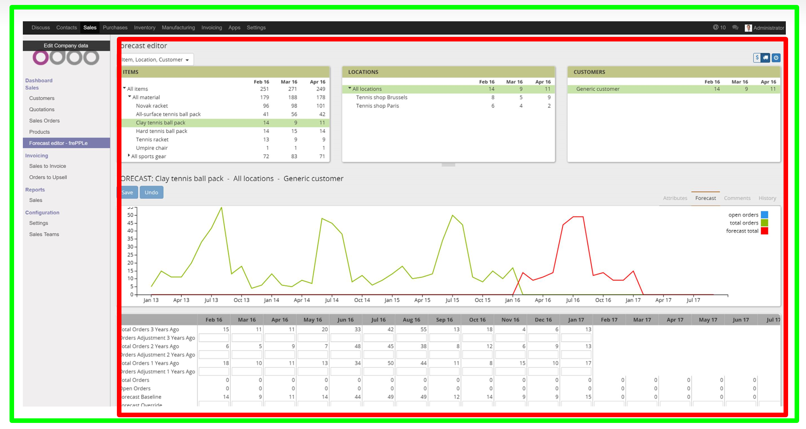
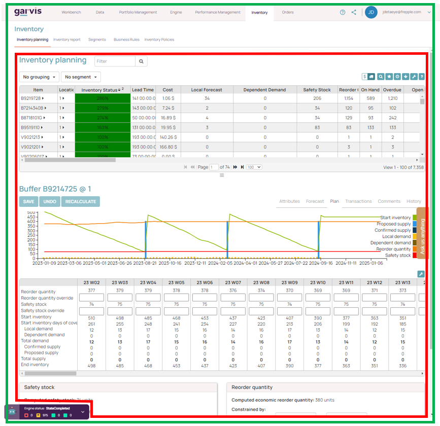
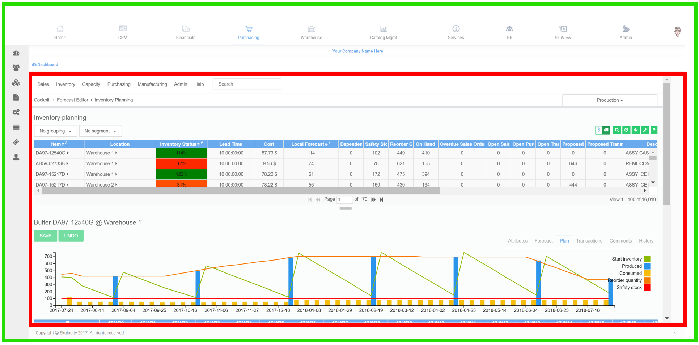

===============================
Embedding in other applications
===============================

ccAPPS has an open and flexible architecture that allows embedding
all planning capabilities and user interface screens in your third
party applications.

| Below are three examples of such an integration.
| The green boundary is the complete user interface. The top one shows the integration with Odoo (see https://odoo.com).
| The content of the red area is generated by ccAPPS.

The remainder of this page contains more information on the
technologies and tasks involved for developing this type of embedding:

- | To start with, you need to be aware of the **MIT license compliance**.
  | The Community Edition of ccAPPS requires a copy of the terms of the MIT
    License and also a copyright notice to be included with all copies of the
    software or its substantial portions.
  | The Enterprise Edition can be embedded also in applications with a different
    license - contact us for details.

- | ccAPPS's web pages are displayed in **an iframe of another web application**.
  | The settings CONTENT_SECURITY_POLICY and X_FRAME_OPTIONS need to be set
    correctly. This avoids browsers from blocking the content that violates the
    `CORS <https://en.wikipedia.org/wiki/Cross-origin_resource_sharing>`_
    security policies.

- | To provide a seamless user experience you can display ccAPPS with **a theme
    that mimics the look and feel of the ccAPPS user interface**.
  | See :doc:`../developer-guide/creating-a-custom-theme`

- | ccAPPS can be configured to **hide or display the navigation bar**.
  | When the ccAPPS navigation bar is hidden, your application will need to
    include the relevant ccAPPS screens in its menus and navigation.

- | Ability to authenticate user with a web token (see https://jwt.io/introduction/) issued
    by another web application.
  | Users only need to log in once. The user authentication is handled your web application,
    which forwards the credentials to ccAPPS in a securely encrypted token.

- The external application needs to **generate a webtoken**, following the see JWT JSON Web
  Token specification: https://jwt.io/introduction/

  The web token specifies:

    - The user that is authenticated. The user must be defined
      in ccAPPS and his/her role and permissions within ccAPPS
      need to be defined: See below.

    - | The expiration time until which the token is valid, expressed as
        seconds since Jan 1st 1970 GMT. The site https://www.epochconverter.com/
        provides a convenient check on these values.
      | A token should normally be valid 1 to 2 hours after its generation.

    - The navbar argument specifies whether ccAPPS should render
      its navigation header or not. In most case you'll want to hide it.

  Below is an example code snippet using the Python PyJWT library (see
  http://pyjwt.readthedocs.io/en/latest/). https://jwt.io/#libraries
  contains links to implementations of the JWT specification in many other
  programming languages.

  ::

     import jwt
     import time
     webtoken = jwt.encode(
       {
       'exp': round(time.time()) + 600,    # Validity of the token
       'user': USERNAME,                   # User name
       'navbar': False                     # Whether or not ccAPPS should render
                                           # its navigation bar or not
       },
       'MY_SECRETKEY',    # The shared secret between ccAPPS and your application
       algorithm='HS256'
       ).decode('ascii')

- | The external application needs to **use an iframe to display ccAPPS's content**.
  | Note how the web token is added as a URL argument to the ccAPPS web browser. (As a
    future enhancement we might also allow putting the token in a HTPP header.)
  | If your application is running under HTTPS, ccAPPS will also need to be configured
    to use HTTPS. Otherwise browsers will refuse to display ccAPPS's unencrypted data
    on the page.

  ::

     <iframe src="https://ccAPPS_URL/?webtoken=WEBTOKEN" width="100%" height="100%"
       marginwidth="0" marginheight="0" frameborder="no" scrolling="yes" />

- | On ccAPPS's side the **shared secret needs to be configured** in the file djangosettings.py.
  | By default it is set to the secret key of the ccAPPS application. It is more secure to
    generate a separate secret key for the web token authentication without sharing
    ccAPPS's own internal secret key.

  ::

     ...
     DATABASES = {
       'default': {
          ...
          SECRET_WEBTOKEN_KEY: 'MY_SECRETKEY',
          ...
          }
       }
     ...

- **Each user accessing ccAPPS will still need to be defined in ccAPPS** and his/her
  role and permissions will need to be defined. See details:
  :doc:`../user-interface/getting-around/user-permissions-and-roles`

- | **Task execution** can be done through a web API, such that your application
    can control and monitor the execution of the jobs.
  | See :doc:`remote-commands`